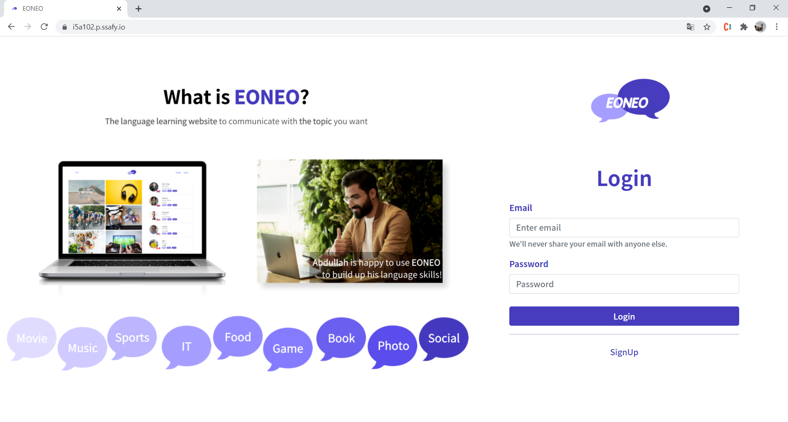
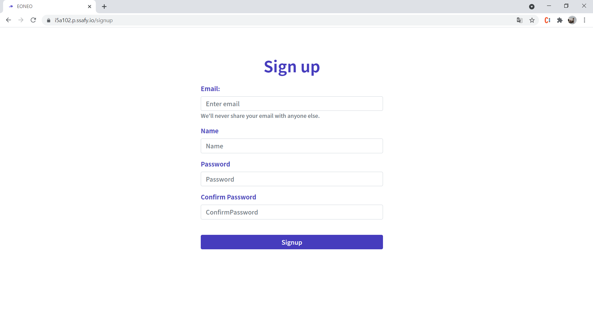
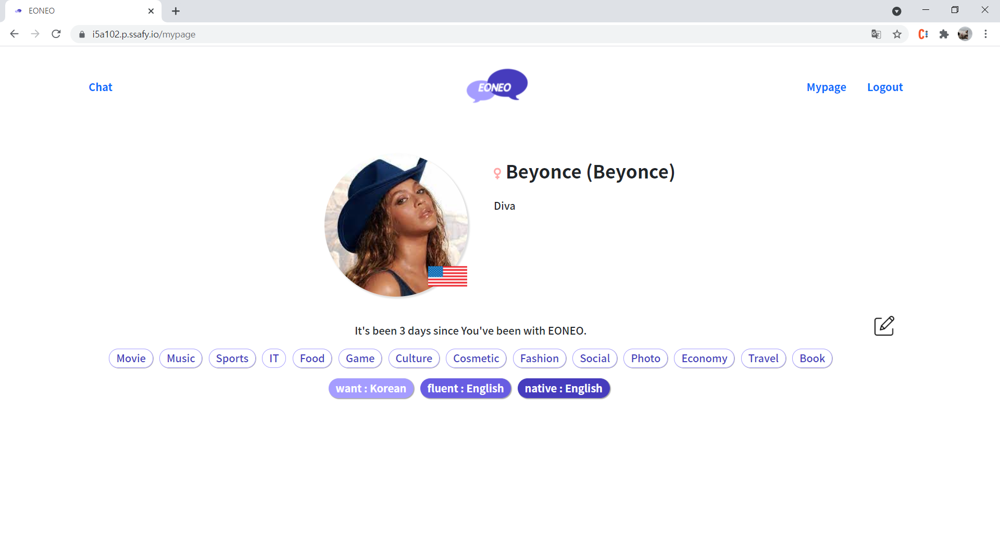
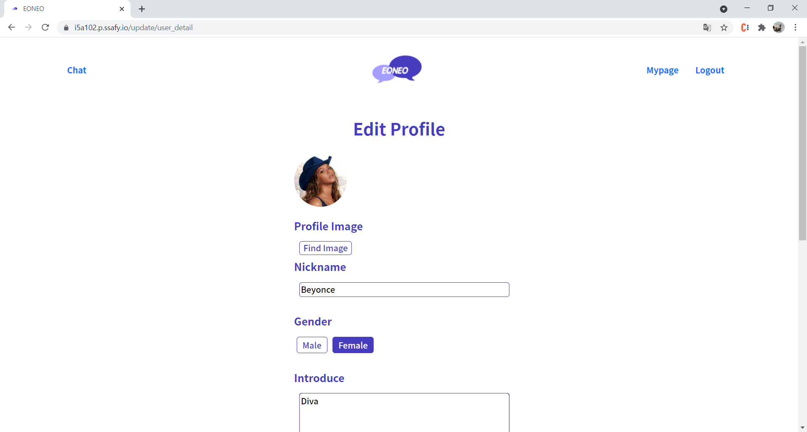
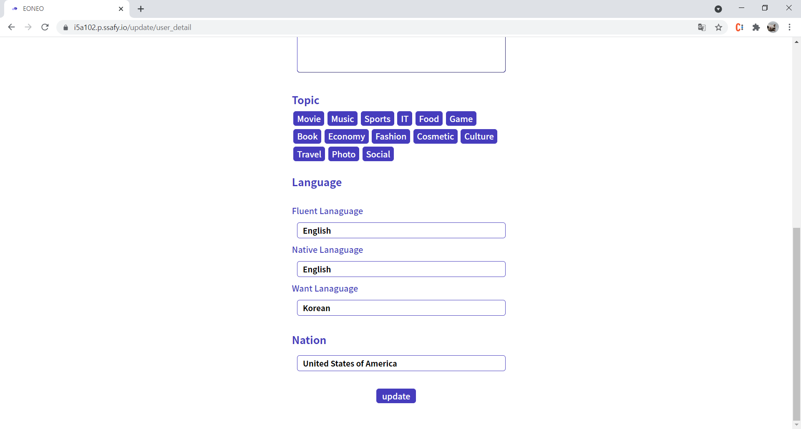
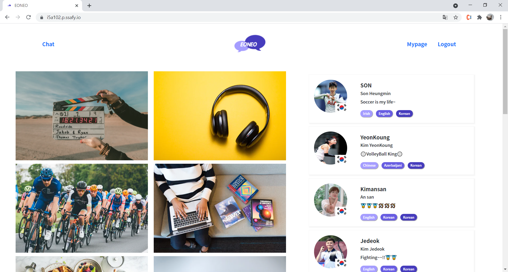
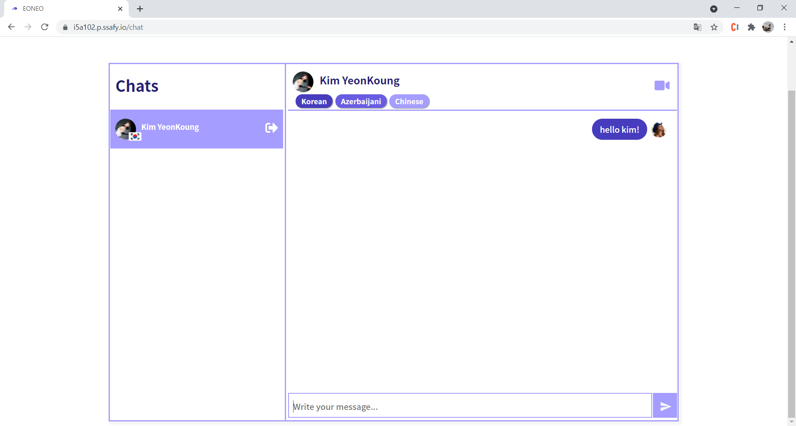

<!-- PROJECT LOGO -->

<br />

  # EONEO

<!-- TABLE OF CONTENTS -->
<details open="open">
  <summary><b>📃목차</b></summary>
  <ol>
    <li>
      [프로젝트 소개](#프로젝트-소개)
      <ul>
        <li>[배포 환경](#배포-환경)</li>
        <li>[개발 환경](#개발-환경)</li>
        <li>[핵심 라이브러리](#핵심-라이브러리)</li>
      </ul>
    </li>
    <li>
      [프로젝트 시작하기](#프로젝트-시작하기)
      <ul>
        <li>[사전 준비](#사전-준비)</li>
        <li>[프로젝트 설치 방법](#프로젝트-설치-방법)</li>
        <li>[깃 커밋 컨벤션](#깃-커밋-컨벤션)</li>
      </ul>
      [팀원](#팀원)
    </li>
    <!-- <li><a href="#usage">Usage</a></li> -->
    <!-- <li><a href="#roadmap">Roadmap</a></li> -->
    <!-- <li><a href="#contributing">Contributing</a></li> -->
    <!-- <li><a href="#license">License</a></li> -->
    <!-- <li><a href="#contact">Contact</a></li> -->
    <!-- <li><a href="#acknowledgements">Acknowledgements</a></li> -->
  </ol>
</details>


<!-- ABOUT THE PROJECT -->

## 프로젝트 소개
**어너**는 다양한 국가의 다양한 언어를 배우고자 하는 사용자들이 서로 언어를 교환하며 성장 할 수 있는 서비스입니다.  
웹사이트에서 적극적이고 진지하게 언어교환을 하고 싶은 사람들을 위하여 시작한 프로젝트입니다.

자신이 배우고 싶은 언어, 할 수 있는 언어, 모국어를 선택 후,  
관심사가 같은 다양한 사람들과 글로벌하게 토킹 해 보세요!☺


#### 로그인


#### 회원가입


#### 마이페이지


#### 사용자 정보 수정



#### 친구 찾기


#### 채팅



### 💜배포 환경
- __URL__ : https://i5a102.p.ssafy.io/
- __배포 여부__ : O 
- __접속 가능__ : 접속 가능 
- __HTTPS 적용__ : O 


### 💜개발 환경

#### FrontEnd
 


#### BackEnd


#### Collaboration


#### Distribution


#### Design


- __JVM__ : 1.8, java8 (openjdk:8-jdk-alpine)
- __NGINX__ : nginx/1.18.0 (ubuntu)
- __Nodejs__ : 14.17.3
- __IntelliJ__ : 2021.1


### 💜핵심 라이브러리

- __OPENVIDU__
  - __링크__ : https://openvidu.io/
  - __소개__ : WebRTC 라이브러리
  - __사용 기능__ : 그룹 화상 회의, 영상 통화를 가능하게 해줌  


- __RECOIL__
  - __링크__ : https://recoiljs.org/ko/
  - __소개__ : React를 위한 상태관리 라이브러리
  - __사용 기능__ : props를 대신하여 React 상태 관리


- __STOMP__
  - __링크__ : https://stomp.github.io/
  - __소개__ : 메시징 프로토콜
  - __사용 기능__ : 메시지 보내기 위한 SEND 명령, 수신 메시지에 SUBSCRIBE 명령


- __SOCKJS client__
  - __링크__ : https://github.com/sockjs
  - __소개__ : webSocket 미지원 브라우저 관리
  - __사용 기능__ : 메시지 통신 시 클라이언트에서 사용

<!-- GETTING STARTED -->

## 프로젝트 시작하기

로컬에서 **어너**프로젝트를 시작하는 방법입니다.
몇 가지 사전 준비를 한 뒤, 다음 절차에 따라 진행 해 보세요!


### 사전 준비

로컬에서 프로젝트를 시작하기 위해 몇 가지를 설치 해야 합니다.
다음 설명을 참고하여 설치 해 주세요!

* nodejs
https://nodejs.org/ko/download/ v14.17.3


### 프로젝트 설치 방법

1. 깃 레포지토리 클론
   ```sh
   git clone https://lab.ssafy.com/s05-webmobile1-sub3/S05P13A102.git
   ```
2. NPM packages 설치
   ```sh
   npm install
   ```
3. front 디렉토리 이동 후 실행
   ```sh
   npm run start
   ```


### 깃 커밋 컨벤션

```
Summary >>> type : title 형식으로 작성
Description >>> 본문은 생략 가능

types = {
	feat : 새로운 기능에 대한 커밋
	fix : 버그 수정에 대한 커밋
	build : 빌드 관련된 파일 수정에 대한 커밋
	chore : 그 외 자잘한 잡다한 것들 수정에 대한 커밋
	ci : CI관련 설정 수정에 대한 커밋
	docs : 문서 수정에 대한 커밋
	style : 코드 스타일 혹은 포맷 등에 관한 커밋
	refactor : 코드 리팩토링에 대한 커밋
	test : 테스트 코드 수정에 대한 커밋
  design : 프론트 디자인에 대한 커밋
}

커밋 메시지 입력 예시:
  feat : 로그인 기능 구현
  feat : Implementation about Login
  fix : 회원가입 - 페이지 버튼 수정
```

<!-- ## Usage
웹사이트에서 적극적이고 진지하게 언어교환을 하고 싶은 사람들을 위해서 나온 프로젝트입니다!
자신이 배우고 싶은 언어, 할 수 있는 언어, 모국어를 선택 후
대화하고 싶은 주제가 동일한 사람들과 글로벌하게 토킹하세요!

언어 실력은 대화를 통해 성장합니다!! -->


<!-- ## Roadmap

See the [open issues](https://github.com/othneildrew/Best-README-Template/issues) for a list of proposed features (and known issues).

 -->

<!-- CONTRIBUTING -->
<!-- ## Contributing

Contributions are what make the open source community such an amazing place to be learn, inspire, and create. Any contributions you make are **greatly appreciated**.

1. Fork the Project
2. Create your Feature Branch (`git checkout -b feature/AmazingFeature`)
3. Commit your Changes (`git commit -m 'Add some AmazingFeature'`)
4. Push to the Branch (`git push origin feature/AmazingFeature`)
5. Open a Pull Request -->


<!-- LICENSE -->
<!-- ## License

Distributed under the MIT License. See `LICENSE` for more information. -->


<!-- CONTACT -->
## 팀원


<p><b>박선아</b></p>

 [@ichangeigidcuzodd](https://github.com/SeonA1223)
<br/>
 bsa14523@gmail.com


<p><b>김나영</b></p>

 [@kimmy01](https://github.com/kimmy01)
<br/>
 lovejb0101@gmail.com


<p><b>윤세일</b></p>

 [@devysi0827](https://github.com/devysi0827)
<br/>
 devysi0827@gmail.com


<!-- ACKNOWLEDGEMENTS
## Acknowledgements
* [GitHub Emoji Cheat Sheet](https://www.webpagefx.com/tools/emoji-cheat-sheet)
* [Img Shields](https://shields.io)
* [Choose an Open Source License](https://choosealicense.com)
* [GitHub Pages](https://pages.github.com)
* [Animate.css](https://daneden.github.io/animate.css)
* [Loaders.css](https://connoratherton.com/loaders)
* [Slick Carousel](https://kenwheeler.github.io/slick)
* [Smooth Scroll](https://github.com/cferdinandi/smooth-scroll)
* [Sticky Kit](http://leafo.net/sticky-kit)
* [JVectorMap](http://jvectormap.com)
* [Font Awesome](https://fontawesome.com)


<!-- MARKDOWN LINKS & IMAGES -->
<!-- https://www.markdownguide.org/basic-syntax/#reference-style-links -->
<!--[contributors-shield]: https://img.shields.io/github/contributors/othneildrew/Best-README-Template.svg?style=for-the-badge
[contributors-url]: https://github.com/othneildrew/Best-README-Template/graphs/contributors
[forks-shield]: https://img.shields.io/github/forks/othneildrew/Best-README-Template.svg?style=for-the-badge
[forks-url]: https://github.com/othneildrew/Best-README-Template/network/members
[stars-shield]: https://img.shields.io/github/stars/othneildrew/Best-README-Template.svg?style=for-the-badge
[stars-url]: https://github.com/othneildrew/Best-README-Template/stargazers
[issues-shield]: https://img.shields.io/github/issues/othneildrew/Best-README-Template.svg?style=for-the-badge
[issues-url]: https://github.com/othneildrew/Best-README-Template/issues
[license-shield]: https://img.shields.io/github/license/othneildrew/Best-README-Template.svg?style=for-the-badge
[license-url]: https://github.com/othneildrew/Best-README-Template/blob/master/LICENSE.txt
[linkedin-shield]: https://img.shields.io/badge/-LinkedIn-black.svg?style=for-the-badge&logo=linkedin&colorB=555
[linkedin-url]: https://linkedin.com/in/othneildrew
[product-screenshot]: images/screenshot.png -->
